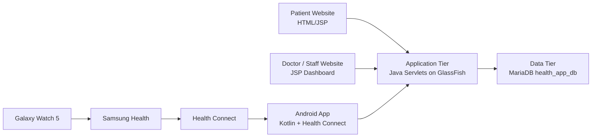

# SmartHealth 3-Tier Architecture

## Overview

SmartHealth is implemented as a 3-tier application:

1. Presentation tier: JSP/HTML website for patients and doctor/staff users, plus the native Android client.
2. Application tier: Java Servlets deployed on GlassFish. The servlets handle login, account creation, patient CRUD, mobile API calls, and health-reading synchronization.
3. Data tier: MariaDB/Supabase PostgreSQL, storing users, authentication records, registered devices, health readings, and sync events.

## Tier Responsibilities

Presentation tier:
- Allows users to create accounts and sign in.
- Allows doctor/staff users to search, view, edit, and delete patient records.
- Allows Android users to sync Health Connect data and view non-diagnostic suggestions.

Application tier:
- Validates form/API input.
- Manages HTTP sessions.
- Executes DML operations through JDBC.
- Separates user-facing interfaces from direct database access.

Data tier:
- Stores patient profiles in `users`.
- Stores password hashes in `user_auth`.
- Stores Galaxy Watch / Health Connect device metadata in `devices`.
- Stores health readings in `pulse_readings`, `temperature_readings`, and `blood_pressure_readings`.
- Stores imported Health Connect time-window summaries in `health_sync_sections`.
- Stores the original Health Connect record id, measured time, sync time, and sync events in the reading tables and `device_sync_events`.

Health sync note:
- The Android app uses section-based Health Connect imports, not continuous watch streaming.
- Direct Galaxy Watch sensor streaming is parked as a future Samsung Health Sensor SDK path after section sync is stable.

## Professional Note

The safer production architecture is to let remote phones and websites connect to the backend API, not directly to MariaDB. Direct database remote access should be limited to administrators, local network demos, or controlled maintenance tasks.
