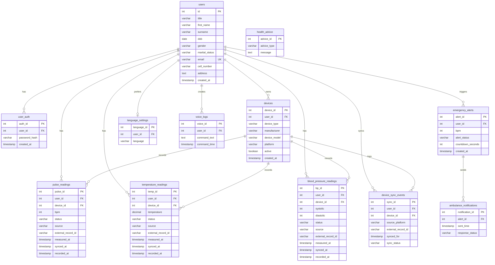

# SmartHealth ERD

This ERD reflects the current SmartHealth database design, including Galaxy Watch 5 readings that flow through Samsung Health, Health Connect, the Android app, and the Java backend.

Additional diagram exports are stored in `docs/diagrams/`:

- `smarthealth-live-eerd.mmd` for the Mermaid source
- `smarthealth-live-eerd-link.txt` for the Mermaid Live editor link
- `smarthealth-top-down-eerd.drawio` for editable Draw.io source
- `smarthealth-top-down-eerd.pdf` for a portable diagram export



## Watch Sync Flow

```text
Galaxy Watch 5 -> Samsung Health -> Health Connect -> Android app -> MobileHealthSyncServlet -> database
```

Health Connect may provide manufacturer/model metadata. When it does, the backend stores that information in `devices` and links each synced reading to the device through `device_id`.
